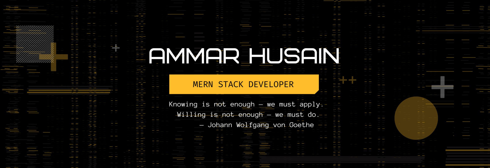

  

##

### About Me
This is <b> Ammar Husain</b>, a passionate learner from Bangladesh—exploring the world of <b>Web Development</b>.  I love building things that make life easier, smoother, and more organized.
I write, I code, I learn — and I try to make something better every day..

Although I’m becoming a <b>MERN Stack Web Developer</b>, my long‑term goal is to dive deeper into <b>Backend Development</b>. For now, I'm focusing on mastering the <b>Frontend</b> — studying advanced concepts, improving UI/UX, and leveling up in React and modern frontend technologies.

 

### What I'm Currently Exploring

- 🚧 Exploring **Next.js** for modern, optimized frontend development  
- 🟦 Learning **TypeScript** to write safer, scalable code  
- ⚙️ Diving into **Advanced Backend Concepts** (authentication, architecture, APIs)  
- 🌐 Improving React UI/UX and sharpening frontend mastery

 

### Skills & Technologies

|       Skills Overview        | Technologies                                                                                                                                                                                                                          |
|-----------------------|---------------------------------------------------------------------------------------------------------------------------------------------------------------------------------------------------------------------------------------|
| **Languages**         |                                                        |
| **Frontend Technologies** |      |
| **Back-End Development** |                                                  |
| **Database**          |                                                      |
| **Tools & Platforms** |       |

&nbsp;

  
  &nbsp;
  

&nbsp;&nbsp;&nbsp;

### Contact me

  
  &nbsp;
  <a href="mailto:sanimammar818@gmail.com"></a

##

  

